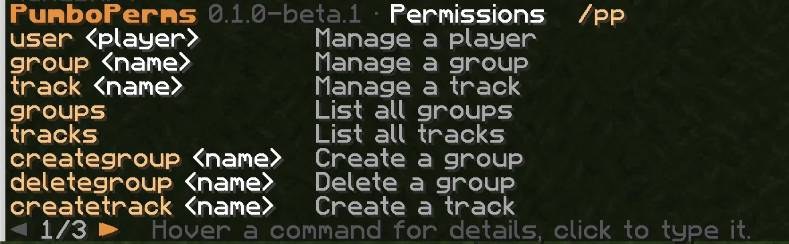
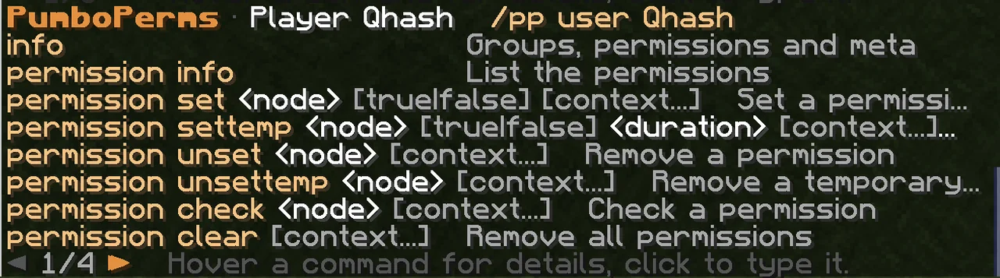
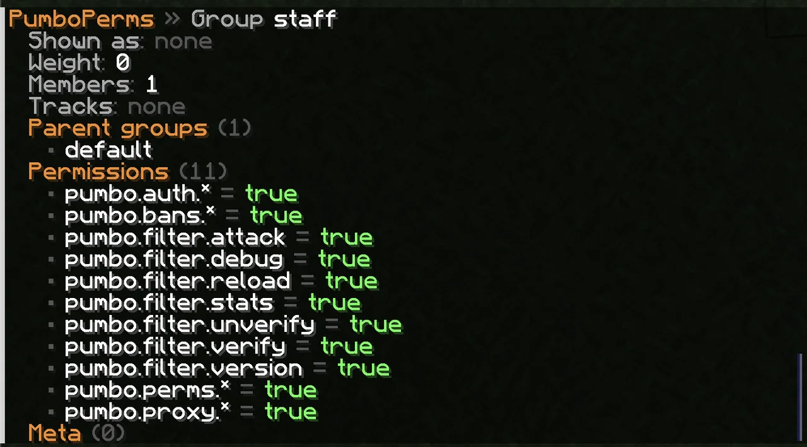

# PumboPerms

Ranks and permissions for Pumpkin servers. Put players into groups, give the groups permissions and prefixes, and move players up and down rank ladders. On the first start PumboPerms takes over the permissions your server already has.

## Features

- **Groups with inheritance and weights.** A group gets the permissions of its parents. When two groups disagree, the heavier one wins.
- **Wildcards.** `minecraft:command.*` or `*`. The most specific node wins.
- **Temporary ranks.** Permissions, groups and prefixes for `1h30m` or `7d`. They end on their own.
- **Contexts.** `world=world_nether` limits a permission, a group or a prefix to one world.
- **Prefixes and suffixes** with priorities, plus your own meta values.
- **Rank ladders** with `/pp promote` and `/pp demote`.
- **Change log, JSON export and import**, with undo.
- **Tab completion** for players, groups, tracks and permission nodes.
- **Closes a Pumpkin 0.2.0 hole.** There `/tp`, `/xp`, `/banip` and `/pardonip` skip the permission check. PumboPerms blocks them for players without the permission.

## Quick start

```
/pp creategroup vip
/pp group vip parent add default
/pp group vip setweight 10
/pp group vip permission set minecraft:command.gamemode
/pp group vip meta setprefix 10 "&6[VIP] "
/pp user Steve parent add vip
```

## Commands

| Command | What it does |
| --- | --- |
| `/pp user <player> info` | Groups, permissions and meta of a player |
| `/pp user <player> permission set\|unset <node>` | Give or take a permission |
| `/pp user <player> parent add\|remove <group>` | Add or remove a group |
| `/pp user <player> meta setprefix <priority> <text>` | Set a prefix |
| `/pp group <name> ...` | The same for groups, plus `setweight` |
| `/pp creategroup <name>` / `deletegroup <name>` | Create or delete a group |
| `/pp track <name> create\|append\|remove` | Build a rank ladder |
| `/pp promote <player> <track>` / `demote` | Move a player one step |
| `/pp log` / `export` / `import` | Change log, backup, restore |
| `/pp reload` / `version` | Reload the config, show the version |

`/pp help` shows every command you may use. `/pp` is short for `/pumboperms`, and `u`, `g`, `t` work for `user`, `group`, `track`. Permissions are named `pumboperms:<name>` and default to operators of level 3.

## Screenshots





## Installation

Drop the file into `plugins/` and start the server. The config is created in `plugins/data/pumboperms/`. Works with Pumpkin 0.2.0 (Minecraft 26.3).

## Running a network?

PumboPerms also runs on [PumboProx](https://github.com/PumboMC/PumboProx): one set of ranks for every server, with differences per server where you need them.

---

PumboPerms is in beta. Try it on a test server before you put players on it.
Source, documentation and issues: https://github.com/PumboMC/PumboPerms (GPL-3.0)

[](https://github.com/PumboMC/PumboProx)
